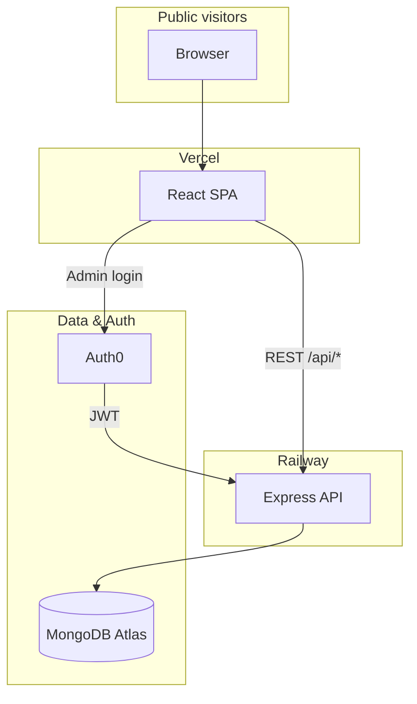
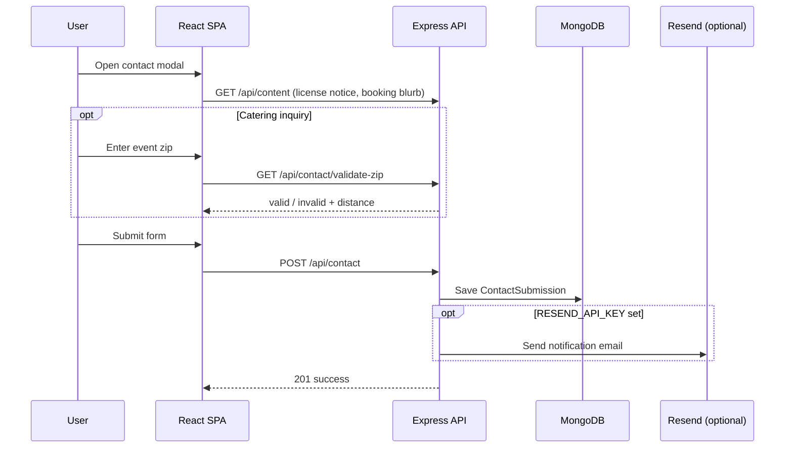
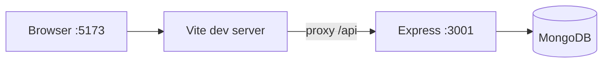

# Architecture

Terrible Gerald's Pizza is a **monorepo at the repository root**: React client (`client/`) and Express API (`server/`) are siblings. Shared scripts live in the root `package.json`.

## System overview



## Layers

| Layer | Location | Role |
|-------|----------|------|
| Public UI | `client/src/pages/public/` | Marketing pages; fetches public API |
| Admin UI | `client/src/pages/admin/` | Auth0-protected CRUD dashboards |
| API | `server/src/routes/` | JSON REST under `/api` |
| Data | Mongoose models | MongoDB Atlas |

## Request flows

### Public content (no auth)

```
Browser → GET /api/events          (upcoming published events)
Browser → GET /api/events/next     (homepage hero event)
Browser → GET /api/events/:slug    (single event by slug)
Browser → GET /api/menu            (active menu items)
Browser → GET /api/faqs            (published FAQs)
Browser → GET /api/content         (site copy key/value map)
Browser → GET /api/contact/validate-zip?zip=  (catering travel radius)
Browser → POST /api/contact        (general or catering inquiry)
```

### Contact inquiry flow



Catering submissions require a US zip within the configured travel radius (default: 40 miles from Omaha). General inquiries skip zip validation.

### Admin content (Auth0 JWT)

```
Admin → Auth0 login → JWT
Admin → Authorization: Bearer {token}
API → checkJwt → requireAdmin → CRUD /api/admin/*
```

Admin access is granted when either:

1. JWT includes permission `admin:content`, or
2. User email is listed in `ADMIN_EMAILS` (server env)

## Data model

| Model | Purpose | Public read | Admin write |
|-------|---------|-------------|-------------|
| `Event` | Pop-up schedule | Yes (published, future) | Yes |
| `MenuItem` | Pizza menu cards | Yes (active) | Yes |
| `Faq` | Homepage FAQs | Yes (published) | Yes |
| `SiteContent` | Key/value copy blocks | Yes | Yes |
| `ContactSubmission` | Booking inquiries (general + catering) | No | Yes (read, status, delete) |
| `User` | Auth0 profile sync | — | Optional |

## Development topology



Vite proxies `/api` to `http://localhost:3001` (`client/vite.config.ts`).

## Legacy migration mapping

| Astro / external | New system |
|------------------|------------|
| Storyblok `api-us.storyblok.com` | `Event` model + `/api/events` |
| getform.io contact POST | `POST /api/contact` → `ContactSubmission` |
| Static menu HTML | `MenuItem` + seed script |
| Static FAQ HTML | `Faq` + seed script |
| Inline copy | `SiteContent` entries |

Reference build: `legacy/astro-dist/`

## Extending the system

1. **New content type**: add Mongoose model → public route (if needed) → admin route → admin page → types in `client/src/types/`
2. **New public page**: add under `client/src/pages/public/`, register in `App.tsx`
3. **File uploads** (future): add object storage (e.g. S3/Cloudinary) — images currently use paths under `client/public/images/`

## Configuration

| Concern | Where |
|---------|--------|
| Client env | `client/.env` — `VITE_*` |
| Server env | `server/.env` — `MONGODB_URI`, Auth0, `ADMIN_EMAILS`, `CLIENT_URL`, Resend (`RESEND_API_KEY`, `CONTACT_NOTIFICATION_EMAIL`, `EMAIL_FROM`), catering radius |
| Production CORS | `CLIENT_URL` on Railway must match Vercel domain |

See also: `.cursorrules`, [FEATURES.md](../FEATURES.md), `docs/deployment/DEPLOYMENT.md`, `docs/migration/ASTRO_MIGRATION.md`.
